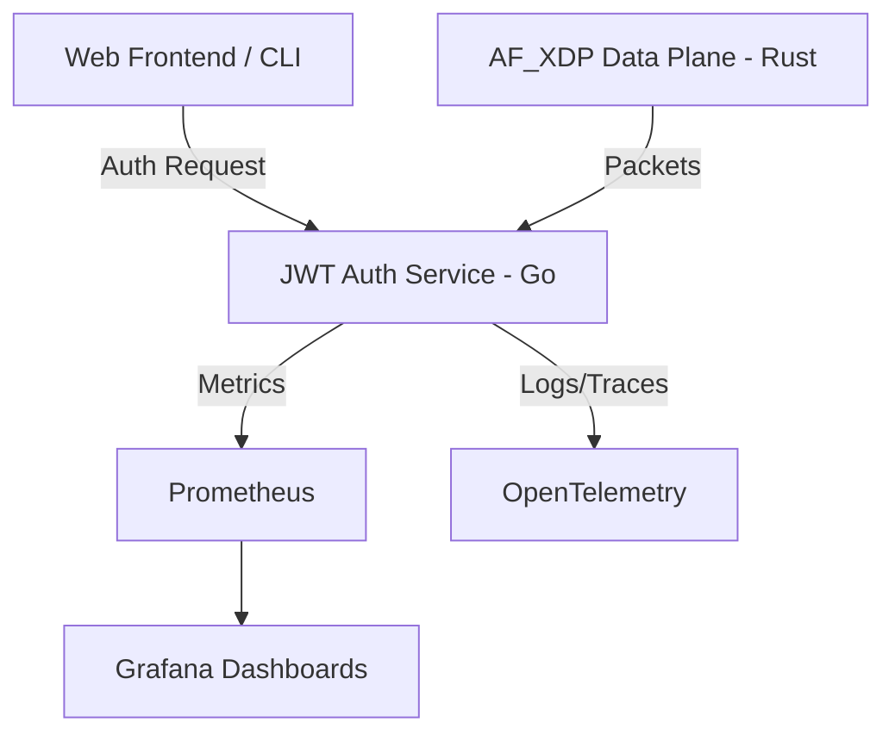

# NexxusFlow: Sovereign Foundations for High-Performance Systems


NexxusFlow is a production-grade educational platform designed to teach the architecture, security, and observability of high-performance sovereign systems.

## 🚀 Hero Features
- **Production-Grade JWT Lab**: HS256 signing, rate limiting, token revocation, and secret rotation.
- **High-Performance Data Plane**: Rust-based AF_XDP packet handling prototypes.
- **Full-Stack Observability**: Integrated Prometheus, Grafana, and OpenTelemetry tracing.
- **Educational First**: Guided tutorials, interactive walkthroughs, and a visual UI.

## 🏗 Architecture
NexxusFlow follows a layered approach:
- **Data Plane (Rust)**: Low-latency, zero-copy networking components.
- **Control Plane (Go)**: Reliable management services (e.g., JWT Auth).
- **Contract Layer (TypeScript)**: Shared schemas ensuring runtime safety.



## 📚 Learning Paths
Start your journey in the [\`education/\`](./education) folder:
1. [**Getting Started**](./education/01-getting-started.md): Bootstrap your environment in 5 minutes.
2. [**JWT Fundamentals**](./education/02-jwt-auth-fundamentals.md): Master production-grade authentication.
3. [**Observability Deep Dive**](./education/03-observability-deep-dive.md): Learn to monitor what matters.

## 🛠 Quick Start (Linux/macOS)
```bash
git clone https://github.com/rwilliamspbg-ops/NexxusFlow
cd NexxusFlow
./run-demo.sh
```

## 🪟 Quick Start (Windows)
```powershell
git clone https://github.com/rwilliamspbg-ops/NexxusFlow
cd NexxusFlow
.\run-demo.ps1
```

## 🧪 Validation
```bash
make test          # Run all workspace tests
make lint          # Run clippy, eslint, and go vet
make smoke-jwt-lab # Validate Docker Compose config
```

## 📜 License
This project is licensed under the AGPL-3.0 License. See [LICENSE](./LICENSE) for details.
